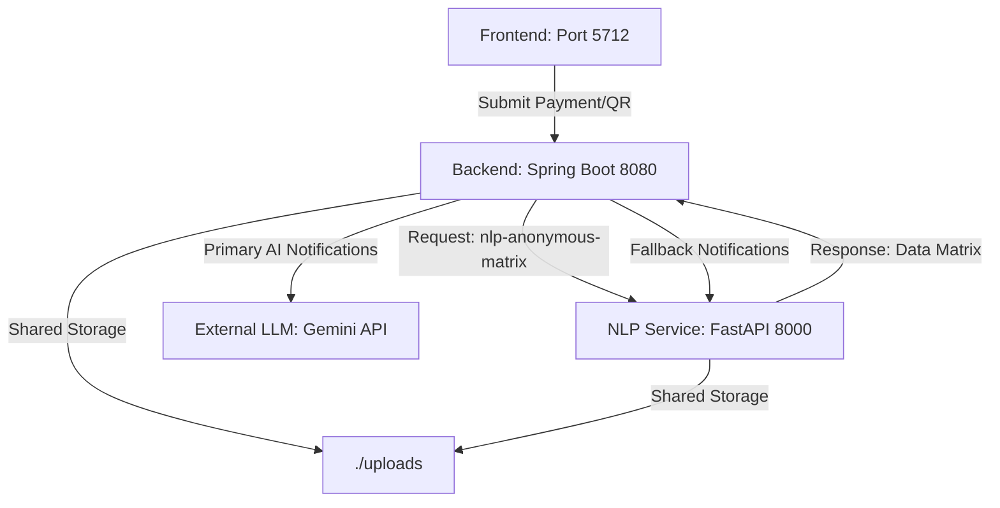

# Bank Insight Coach 💰🤖

**Bank Insight Coach** is a modern, AI-powered financial companion designed to help users track, analyze, and optimize their spending habits. By combining the power of **Spring Boot**, **FastAPI (Python)**, and **React**, it provides deep insights into transaction history, automated categorization, and real-time AI-driven financial coaching.

---

## 🌟 Key Features

<table>
<tr>
<td width="50%" valign="top">

### 📊 Smart Transaction Analysis

<p align="center">
  
</p>

Upload your bank statements in **CSV, XLSX, or PDF** formats.

- Filter by category (Food, Shopping, Salary, etc.)
- Clean debit/credit transaction history
- NLP-based auto categorization

</td>

<td width="50%" valign="top">

### 🧠 AI-Driven Financial Insights

<p align="center">
  
</p>

Powered by **Google Gemini Pro**:

- Spending alerts (e.g., high food expense)
- Financial health metrics
- Savings & trend analysis

</td>
</tr>
</table>
📲 Keep Scan & Pay Clean (Improved Row

---

## 📲 Interactive Scan & Pay

<p align="center">
  
  
  
</p>

- QR Payment Simulation
- Behavioral AI Feedback
- Instant Coaching Notifications

---

## 🏗️ System Architecture

The project follows a robust three-tier microservices architecture:



1.  **React Frontend**: Provides a premium, responsive UI for users to upload statements and view insights.
2.  **Spring Boot Backend**: Handles file processing (PDF/Excel extraction), data orchestration, and coordinates AI feedback. It primarily uses **Gemini AI** for coaching notifications, with a local **NLP-based fallback** mechanism.
3.  **Python NLP Service**: A specialized FastAPI service that performs high-speed transaction categorization, trend detection, and provides fallback financial signals.

---

## 🚀 Getting Started

### 📋 Prerequisites

- **Java 17+** & Maven
- **Python 3.9+**
- **Node.js 18+** & NPM
- **Google Gemini API Key** (Get one from [Google AI Studio](https://aistudio.google.com/))

### 🛠️ Installation & Setup

#### 1. NLP Service (Python)

```bash
cd bank-insight-nlp
python -m venv venv
# Windows: venv\Scripts\activate
# Unix: source venv/bin/activate
pip install -r requirements.txt
uvicorn main:app --reload --host 0.0.0.0 --port 8000
```

#### 2. Backend Service (Spring Boot)

1. Navigate to `bank-insight-backend/src/main/resources/application.yml`.
2. Update the `gemini.api.key` with your valid key:
   ```yaml
   gemini:
     api:
       key: YOUR_GEMINI_API_KEY
   ```
3. Run the application:
   ```bash
   cd bank-insight-backend
   mvn spring-boot:run
   ```

#### 3. Frontend (React)

```bash
cd bank-insight-frontend
npm install
npm run dev
```

The application will be available at `http://localhost:5712`.

---

## 🔌 API Reference

### Backend Endpoints (Port 8080)

| Endpoint                              | Method | Description                                    |
| :------------------------------------ | :----- | :--------------------------------------------- |
| `/api/transactions/upload`            | `POST` | Upload CSV/XLSX/PDF statements                 |
| `/api/transactions/insights`          | `GET`  | Fetch basic spending insights (Proxied to NLP) |
| `/api/ai/insight`                     | `POST` | Generate deep AI analysis via Gemini           |
| `/api/payments/qr`                    | `POST` | Process QR payment and trigger AI notification |
| `/api/insights/latestNlpNotification` | `GET`  | Get the latest AI coaching notification        |

### NLP Service Endpoints (Port 8000)

| Endpoint           | Method | Description                                      |
| :----------------- | :----- | :----------------------------------------------- |
| `/insights`        | `GET`  | Process and categorize all transactions          |
| `/recalculate`     | `POST` | Re-trigger categorization and insight generation |
| `/nlpNotification` | `GET`  | Generate financial signals and NLP notifications |

---

## 🛠️ Tech Stack

- **Frontend**: React.js, Tailwind CSS (Design Tokens), Framer Motion (Animations), Vite.
- **Backend**: Java, Spring Boot, Spring Web, Maven.
- **Data & AI**: Python, FastAPI, Pandas, Google Gemini API.
- **Format Support**: Apache POI (Excel), OpenPDF/Tabula (PDF extraction).

---

> [!TIP]
> Make sure the `uploads/` directory exists in the project root to allow shared access between the Backend and NLP services.

Developed by Harsh Singh (@HarshStag)
