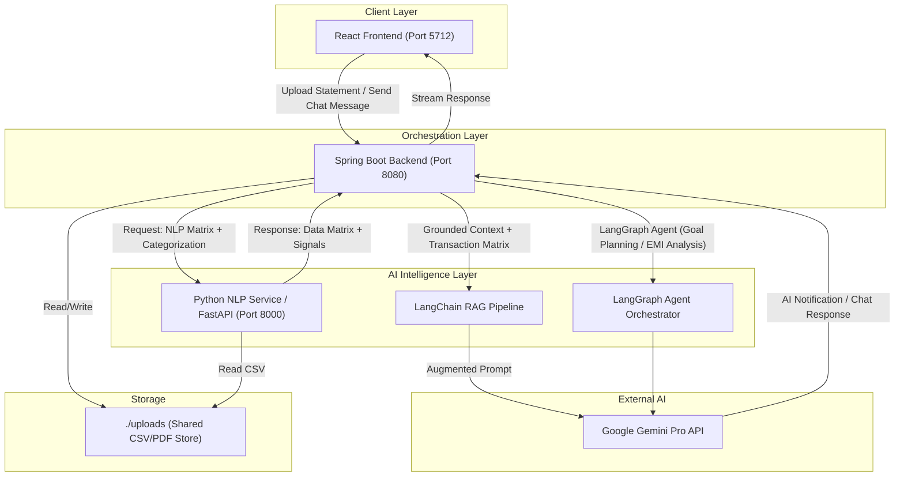

# FinPulse AI 💰🤖

### _Your AI-Powered Conversational Financial Coach_

**FinPulse AI** is a production-grade, intelligent banking companion that bridges the gap between raw transaction data and meaningful, actionable financial decisions. By combining **Retrieval-Augmented Generation (RAG)**, **LangChain**, **LangGraph**, and **Google Gemini Pro**, the platform delivers a context-aware AI assistant that understands your spending behavior and helps you achieve your financial goals — all in natural language.

> Built for the next generation of personal finance: beyond dashboards, toward intelligent conversation.

---

## 🌟 The Problem We Solve

Traditional banking apps show you _what_ you spent. **FinPulse AI** tells you _what to do next._

Most users lack the financial literacy to interpret their own bank statements. They don't know:

- Whether they can afford that AC or vehicle this month.
- How to plan EMI obligations around existing expenses.
- What savings target they should hit to apply for a home loan.
- Which bank products (insurance, SIP, credit card) are actually suitable for them.

FinPulse AI solves this gap by building an **AI-powered conversational financial coach** that combines transaction analytics, behavioral insights, and Generative AI.

---

## 🌟 Key Features

<table>
<tr>
<td width="50%" valign="top">

### 📊 Smart Transaction Analysis

<p align="center">
  
</p>

Upload your bank statements in **CSV, XLSX, or PDF** formats.

- Filter by category (Food, Shopping, Salary, EMI, etc.)
- Clean debit/credit transaction history
- **NLP-based auto-categorization** via a dedicated Python microservice
- Real-time financial metrics dashboard

</td>

<td width="50%" valign="top">

### 🧠 AI-Driven Financial Coaching

<p align="center">
  
</p>

Powered by **Google Gemini Pro** + **RAG Pipeline**:

- **Transaction-triggered AI notifications** with behavioral context
- Spending alerts (e.g., "Food spend is 40% over your average")
- Savings target recommendations
- Loan/EMI affordability analysis

</td>
</tr>
</table>

---

## 💬 Conversational Financial Planner

<p align="center">
  
  
  
</p>

The AI chatbot is not a generic assistant — it is a **context-aware financial planner** that is grounded in your actual transaction history.

**Example Conversations:**

- _"Can I afford an AC this month?"_ → AI evaluates current spending behavior, existing EMIs, and savings runway to give a recommendation.
- _"How much should I save to get a home loan in 6 months?"_ → AI calculates a personalized savings target based on your income and spending patterns.
- _"What's my biggest unnecessary expense?"_ → AI identifies behavioral patterns across categorized transactions.
- _"Am I eligible for a higher credit limit?"_ → AI assesses financial health metrics and recommends the right bank product.

**Banks can also use FinPulse AI** to intelligently recommend relevant financial products — loans, credit cards, insurance, SIPs, or investment plans — based on customer behavior and financial needs, turning the platform into a powerful cross-sell and upsell engine.

---

## 🏗️ System Architecture

The platform is built on a **three-tier microservices architecture** with a dedicated AI pipeline layer powered by **LangChain** and **LangGraph**.


```mermaid
graph TD
    subgraph "Client Layer"
        A["React Frontend (Port 5712)"]
    end

    subgraph "Orchestration Layer"
        B["Spring Boot Backend (Port 8080)"]
    end

    subgraph "AI Intelligence Layer"
        C["Python NLP Service / FastAPI (Port 8000)"]
        D["LangChain RAG Pipeline"]
        E["LangGraph Agent Orchestrator"]
    end

    subgraph "External AI"
        F["Google Gemini Pro API"]
    end

    subgraph "Storage"
        G["./uploads (Shared CSV/PDF Store)"]
    end

    A -- "Upload Statement / Send Chat Message" --> B
    B -- "Request: NLP Matrix + Categorization" --> C
    C -- "Response: Data Matrix + Signals" --> B
    B -- "Grounded Context + Transaction Matrix" --> D
    D -- "Augmented Prompt" --> F
    F -- "AI Notification / Chat Response" --> B
    B -- "LangGraph Agent (Goal Planning / EMI Analysis)" --> E
    E --> F
    B -- "Stream Response" --> A
    B -- "Read/Write" --> G
    C -- "Read CSV" --> G
```

### Layer Breakdown

| Layer                    | Technology                    | Responsibility                                               |
| ------------------------ | ----------------------------- | ------------------------------------------------------------ |
| **Frontend**             | React.js, Vite, Framer Motion | UI, chat interface, dashboard, statement upload              |
| **Backend Orchestrator** | Spring Boot, Java 17          | File processing, API orchestration, RAG coordination         |
| **NLP Microservice**     | Python, FastAPI, Pandas       | Transaction categorization, behavioral signal generation     |
| **RAG Pipeline**         | LangChain                     | Retrieves user financial context, augments LLM prompts       |
| **Agent Graph**          | LangGraph                     | Multi-step reasoning for goal planning (EMI, loans, savings) |
| **LLM**                  | Google Gemini Pro             | Natural language generation for notifications and chat       |

---

## 🧠 How the AI Works: RAG + LangGraph

### RAG Pipeline (Retrieval-Augmented Generation)

Unlike a generic chatbot, FinPulse AI does not hallucinate financial advice. Before every AI response, a **LangChain RAG pipeline** retrieves the user's financial context from their transaction history:

1. **Retrieval**: Categorized transactions, NLP-generated signals (high food spend, low savings rate, upcoming EMI), and behavioral metrics are assembled as a structured **financial context matrix**.
2. **Augmentation**: This matrix is injected into the prompt as grounded context, ensuring the LLM has real data to reason over — not generic assumptions.
3. **Generation**: Google Gemini Pro generates a personalized, context-aware response (coaching notification or chat reply).

### LangGraph Agent (Multi-Step Reasoning)

For complex financial planning queries (e.g., _"Can I afford a home loan?"_), a **LangGraph agent** orchestrates multi-step reasoning:

```
[User Query] → [Intent Classification] → [Data Retrieval Node]
    → [Financial Calculation Node] → [Risk Assessment Node]
    → [Recommendation Generation Node] → [Response]
```

This agentic workflow allows the system to break down complex financial decisions into logical steps, just like a human financial advisor would.

---

## 🚀 Getting Started

### 📋 Prerequisites

- **Java 17+** & Maven
- **Python 3.9+**
- **Node.js 18+** & NPM
- **Google Gemini API Key** (Get one from [Google AI Studio](https://aistudio.google.com/))

### ⚡ One-Command Startup (Recommended)

This project uses `concurrently` to start all three services simultaneously from the project root.

```bash
# From the project root: bank-ai-coach/
npm install       # Only needed the first time
npm run dev       # Starts NLP + Spring Boot + React together (Single Terminal)
```

**Windows Users (Separate Terminals):**
If you prefer each service to run in its own window for easier debugging:
```bash
npm run dev:windows
```

**That's it.** All services will start with color-coded logs in a single terminal:

- `[NLP]` → Python FastAPI on port `8000`
- `[SPRING]` → Spring Boot on port `8080`
- `[REACT]` → React Frontend on port `5712`

Press `Ctrl + C` once to shut all services down cleanly.

---

### 🛠️ Manual Setup (Alternative)

#### 1. Configure Gemini API Key

Navigate to `bank-insight-backend/src/main/resources/application.yml` and update:

```yaml
gemini:
  api:
    key: YOUR_GEMINI_API_KEY
```

#### 2. NLP Service (Python)

```bash
cd bank-insight-nlp
python -m venv venv
# Windows: venv\Scripts\activate | Unix: source venv/bin/activate
pip install -r requirements.txt
uvicorn main:app --reload --host 0.0.0.0 --port 8000
```

#### 3. Backend Service (Spring Boot)

```bash
cd bank-insight-backend
./mvnw spring-boot:run
```

#### 4. Frontend (React)

```bash
cd bank-insight-frontend
npm install
npm run dev
```

The application will be available at **`http://localhost:5712`**.

---

## 🔌 API Reference

### Backend Endpoints (Port 8080)

| Endpoint                              | Method | Description                                   |
| :------------------------------------ | :----- | :-------------------------------------------- |
| `/api/transactions/upload`            | `POST` | Upload CSV/XLSX/PDF statements                |
| `/api/transactions/insights`          | `GET`  | Fetch spending insights (proxied to NLP)      |
| `/api/ai/insight`                     | `POST` | Generate deep AI analysis via Gemini RAG      |
| `/api/payments/qr`                    | `POST` | Process QR payment, trigger AI notification   |
| `/api/insights/latestNlpNotification` | `GET`  | Get latest AI coaching notification           |
| `/api/chat`                           | `POST` | Send message to the LangGraph financial agent |

### NLP Service Endpoints (Port 8000)

| Endpoint           | Method | Description                                   |
| :----------------- | :----- | :-------------------------------------------- |
| `/insights`        | `GET`  | Categorize transactions & compute metrics     |
| `/recalculate`     | `POST` | Re-trigger categorization & signal generation |
| `/nlpNotification` | `GET`  | Generate NLP-based financial signals          |

---

## 🛠️ Tech Stack

| Category             | Technology                                         |
| -------------------- | -------------------------------------------------- |
| **Frontend**         | React.js, Vite, Tailwind CSS, Framer Motion        |
| **Backend**          | Java 17, Spring Boot, Spring Web, Maven            |
| **AI Orchestration** | LangChain (RAG Pipeline), LangGraph (Agent Graphs) |
| **LLM**              | Google Gemini Pro API                              |
| **NLP Service**      | Python, FastAPI, Pandas, NLTK                      |
| **File Processing**  | Apache POI (Excel), Tabula / OpenPDF (PDF)         |
| **Dev Tooling**      | `concurrently` (multi-service runner)              |

---

> [!TIP]
> Make sure the `uploads/` directory exists in the project root. It is the shared file store between the Spring Boot backend and the Python NLP service.

> [!NOTE]
> Add .env file in bank-insight-backend GEMINI_API_KEY=XXXXXXXXXXXXXX

> [!NOTE]
> The LangChain RAG pipeline and LangGraph agent are part of the **roadmap**. The current version uses a direct Gemini API call with a manually constructed financial context matrix — which follows the same RAG principles but without the LangChain abstraction layer yet.

---

Developed by **Harsh Singh** ([@HarshStag](https://github.com/Harshstag))
